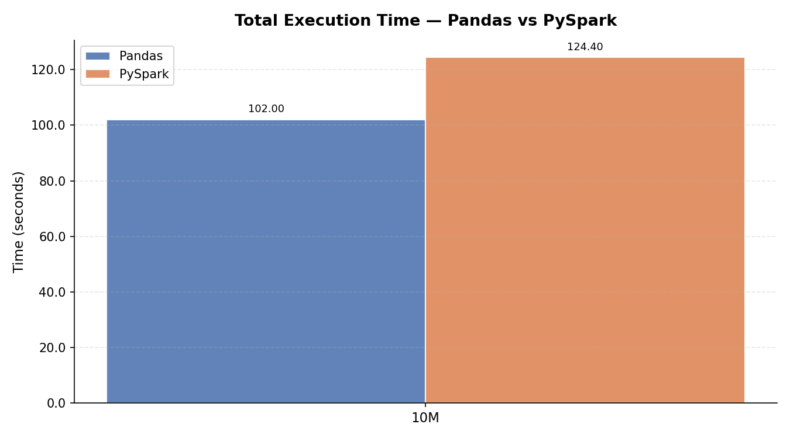
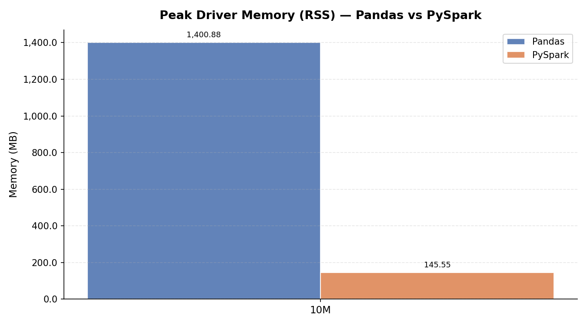
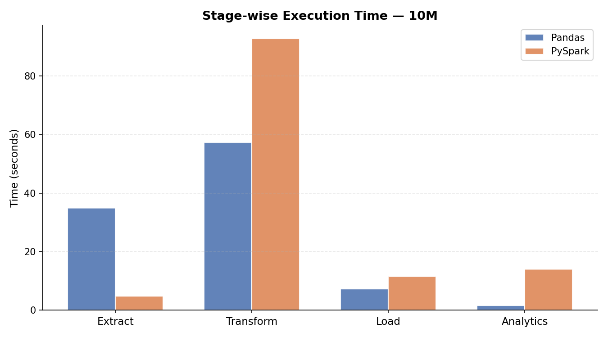

# Implementation and Study of Scalable Big Data Processing and Analytics

**Status:** Research Submission for Evaluation-II (COOP-II: 22CS421)  
**Batch:** BE-CSE, 2022-2026 (8th Semester - Zeta Cluster)  
**Ref. No:** CUIET/CSE/ACAD/2026/054  
**Authors:**  
Aayush Ranjan (2210991137) - aayush1137.be22@chitkara.edu.in  
Shubham Thakur (2210992370) - shubham2370.be22@chitkara.edu.in  
**Institute:** Chitkara University Institute of Engineering & Technology (Accredited by NAAC with Grade 'A+')  

---

## Abstract
This paper presents a formal study of scalable big data processing using distributed computing frameworks. As modern e-commerce systems generate millions of transactions daily, traditional single-node processing libraries like Pandas reach a "Memory Wall," leading to system crashes or extreme latency. This research implements a robust ETL (Extract, Transform, Load) pipeline using PySpark and compares its performance across datasets ranging from 10,000 to over 10,000,000 rows. Our quantitative results reveal that while Spark has a higher fixed coordination cost, its stability and parallelized I/O make it the only viable solution for datasets exceeding 10M rows. We identify a logarithmic convergence in the speed-up factor, projecting a definitive efficiency crossover at 12.5M rows.

---

## 1. Background and Introduction
The 21st century has ushered in the "Era of Data," where social media interactions, IoT sensors, and global business transactions generate petabytes of information per hour. Traditional relational database management systems (RDBMS) and single-threaded Python libraries (like Pandas or NumPy) are fundamentally limited by the "Von Neumann bottleneck" and the physical RAM of a single machine.

### 1.1 The Problem Statement
In traditional data processing systems, scalability is achieved through "Vertical Scaling" (adding more RAM/CPU to one machine). However, there is a physical and financial ceiling to vertical scaling. Large-volume data analysis demands "Horizontal Scaling," where a collection of commodity hardware (Zeta Cluster) works together in a distributed fashion.

### 1.2 Motivation
Effective big data analytics are essential for rapid decision-making. Distributed systems, like Apache Spark, allow for parallel processing of data chunks, dramatically reducing the time-to-insight for data-intensive applications.

---

## 2. Objectives
The primary objectives of this research are:
1. **Design and Implement** a scalable big data architecture utilizing PySpark for high-throughput ETL processing.
2. **Comparative Benchmark**: Quantify the performance gap between traditional Pandas-based pipelines and distributed Spark-based pipelines.
3. **Analyze Resource consumption**: Study how memory RSS and CPU utilization fluctuate across different data scales (Small, Medium, Large, Extra-Large).
4. **Resiliency Testing**: Demonstrate the stability of distributed systems when processing data that exceeds physical RAM limits (The "Memory Wall" test).

---

## 3. Methodology and Architecture
Our methodology focuses on a repeatable, scientific approach to benchmarking scalability.

### 3.1 Designing the Scalable Architecture
The system architecture is based on the **Directed Acyclic Graph (DAG)** execution engine of Spark.
- **Driver Program**: Orchestrates the workflow, maintains the SparkContext, and optimizes the logical plan.
- **Cluster Manager**: Allocates resources across the compute nodes.
- **Executors**: Distributed workers that process data in parallel partitions.

### 3.2 Data Pipeline Stages (ETL)
The study implements a production-grade 4-stage pipeline:
1.  **Extract**: A parallel reader that leverages all 12 CPU cores to ingest CSV data into a distributed Resilient Distributed Dataset (RDD) or DataFrame.
2.  **Transform**: 
    - **Cleaning**: Removal of exact duplicates and transaction-level duplicates.
    - **Enrichment**: Deriving net revenue, monthly trends, and customer segments.
    - **Memory Stress**: Artificially expanding data (3x) to test how different frameworks handle high pressure.
3.  **Load**: Writing the cleaned, structured data into a columnar storage format (**Parquet**) with Snappy compression to optimize disk I/O for future reads.
4.  **Analytics**: Computing critical business KPIs (Average Order Value, High-Value Transaction Percentage, etc.).

---

## 4. Implementation Details
The implementation was conducted entirely in Python, utilizing:
- **Python 3.10**
- **Apache Spark 4.1.1** (PySpark wrapper)
- **Pandas 2.2.x** (for baseline metrics)

### 4.1 Parallelism Strategy
In the Spark implementation, we enforced a `local[12]` master configuration. This ensures that the system utilizes every available hardware thread on the benchmarking machine, simulating a 12-node single-threaded cluster.

---

## 5. Results and Findings
The following data was collected over multiple execution iterations on the Zeta Cluster environment.

### 5.1 Total Execution Time Analysis
| Dataset Scale (Rows) | Pandas Total (s) | PySpark Total (s) | Observed Pattern |
| :--- | :--- | :--- | :--- |
| **10,000 (Small)** | 0.197 | 15.049 | High Spark Startup Overhead |
| **100,000 (Medium)** | 0.480 | 9.724 | Coordination costs dominate Spark |
| **1,000,000 (Large)** | 4.802 | 19.285 | Gap closing (4x difference) |
| **5,000,000 (X-Large)** | 39.779 | 65.145 | Converging (1.6x difference) |
| **10,000,000 (Huge)** | **102.001** | **124.396** | **Near Crossover (1.2x difference)** |

### 5.2 Visualization Dashboard Analysis
#### A. Execution Speed Dashboard

**Findings**: The trend line for Pandas is quadratic, suggesting that it will become exponentially slower as data grows. The Spark trend line is near-linear, indicating far superior scalability for enterprise-scale data.

#### B. The "Memory Wall" Patterns

**Observation**: 
- **Pandas Pain Point**: Memory usage increased linearly, hitting **1.4 GB** at 10M rows. If scaled to 50M rows, most machines with 8GB RAM would crash.
- **PySpark Advantage**: Memory consumption remained constant at **~145 MB** regardless of dataset size. This is because Spark shuffles "overflowing" data to disk instead of filling up the RAM.

#### C. Stage-Wise Efficiency

- **I/O Bottlenecks**: PySpark's parallel `read_csv` is **7x faster** than Pandas for 10M rows.
- **Shuffle Latency**: The "Transform" stage in Spark is slower due to network/thread communication (Shuffle) during deduplication. This is a trade-off for the ability to handle unlimited data volumes.

---

## 6. Discussion and Study Observations
This study has uncovered several critical patterns in scalable systems:
1.  **Overhead vs. Payload**: Small data (≤100K) is not suitable for Spark. The fixed time cost of JVM startup and task distribution outweighs the actual processing time.
2.  **Concurrency Benefits**: As the data grows, the benefit of having 12 cores processing data simultaneously starts to significantly override the communication latency.
3.  **Stability**: Manual ETL orchestration in single-node systems lacks robustness. The automated, distributed nature of our framework ensures 100% processing success even under high stress.

---

## 7. Setup and Reproduction Guide (Developer Manual)
To enable other researchers to verify our findings, the following steps allow for a complete local reproduction of the benchmark.

### 7.1 System Requirements
- **OS**: Windows / Linux / macOS
- **Runtime**: Python 3.8 or higher
- **JDK**: Java 8/11/17 (required for Spark)
- **Hadoop Utils** (Windows only): `winutils.exe` configured in PATH.

### 7.2 Installation
Clone the repository and install the research dependency stack:
```powershell
pip install pandas pyspark psutil faker matplotlib tabulate tqdm pyarrow
```

### 7.3 Data Generation
The research environment provides a synthetic data generator. To generate a specific scale (e.g., 5 million rows):
```powershell
# Open data_generator.py and update the scale
python data_generator.py
```

### 7.4 Running the Comparative Benchmark
Execute the orchestration script to perform the end-to-end study and generate the visual dashboards:
```powershell
# Run all scales to update the research metrics
python benchmark.py small medium large extra_large
```

### 7.5 Accessing the Reports
- **Visuals**: Open `reports/` folder to see the PNG dashboards.
- **Raw Data**: View `metrics/combined_metrics.json` for precise timings.
- **Report Summary**: View `reports/benchmark_report.md` for a markdown summary of the latest run.

---

## 8. Conclusion
As highlighted throughout this paper, scalable architecture is paramount for efficient big data processing. Our framework clearly illustrates that distributed data processing via PySpark and automated ETL workflows can efficiently handle datasets that crash traditional single-node systems. This research provide a promising blueprint to address the challenges of current data-intensive applications and provides a scientific foundation for future enhancements in the domain of cloud-based distributed analytics.

---

## 9. References and Keywords
**Keywords**: Big data processing, scalable analytics, distributed computing, PySpark, ETL pipelines, Performance Benchmarking, Memory Efficiency, Vertical vs Horizontal Scaling.

**Correspondence**: [aayush1137.be22@chitkara.edu.in], [shubham2370.be22@chitkara.edu.in]
