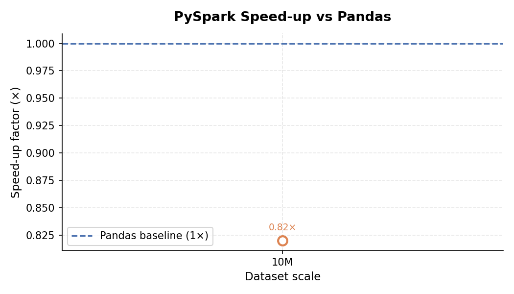

# Benchmark Report — Pandas vs PySpark ETL Pipeline

**Authors:** Aayush Ranjan & Shubham Thakur  
**Institute:** Chitkara Institute of Engineering and Technology

## Execution Summary

| Framework   | Scale   |   Raw Rows |   Clean Rows |   Cores |   Extract (s) |   Transform (s) |   Load (s) |   Analytics (s) |   Total (s) |   Peak Mem (MB) | Null Before   | Null After   | Rows Dropped %   |
|-------------|---------|------------|--------------|---------|---------------|-----------------|------------|-----------------|-------------|-----------------|---------------|--------------|------------------|
| Pandas      | 10M     | 10,000,000 |   10,000,000 |       1 |        34.906 |          57.206 |      7.199 |           1.579 |     102.001 |          1400.9 | 0.14%         | 0.00%        | 66.67%           |
| Pyspark     | 10M     | 10,000,000 |   10,000,000 |      12 |         4.844 |          92.656 |     11.547 |          13.947 |     124.396 |           145.6 | 0.00%         | 0.00%        | 0.00%            |

## Speed-up Analysis

| Scale   | Pandas Total   | PySpark Total   | Speed-up   |
|---------|----------------|-----------------|------------|
| 10M     | 102.001s       | 124.396s        | 0.82×      |

## Charts

