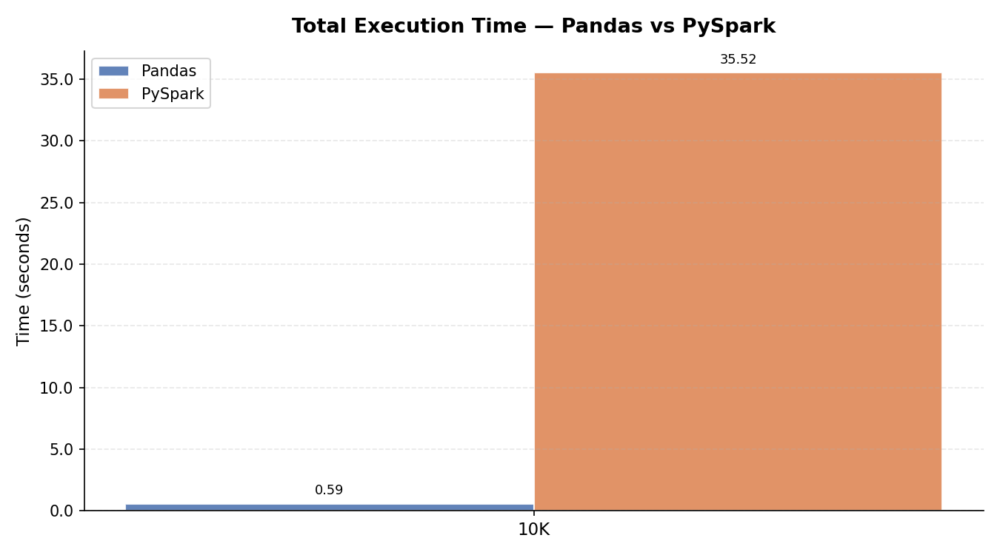
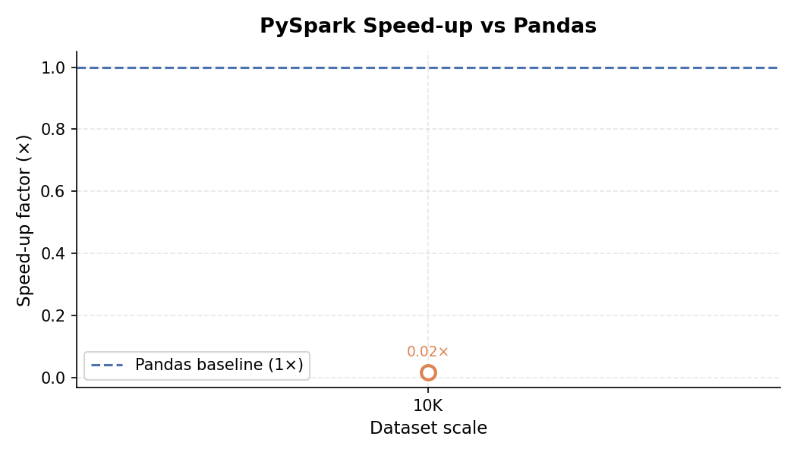
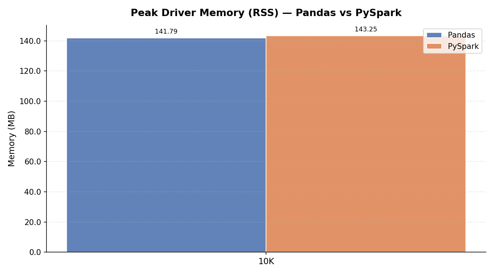
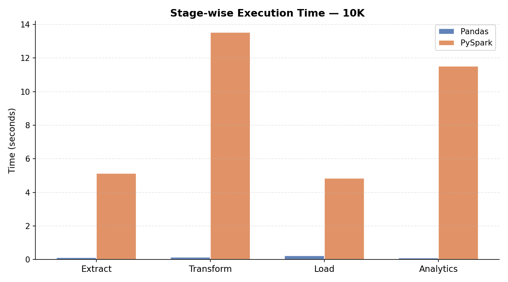
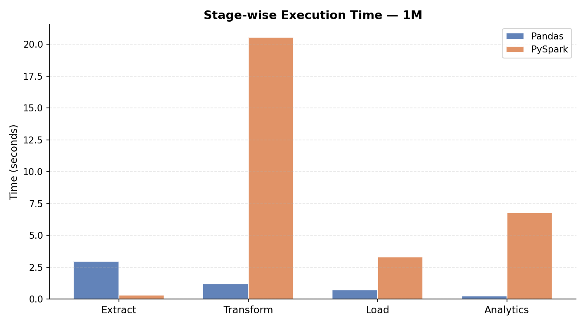
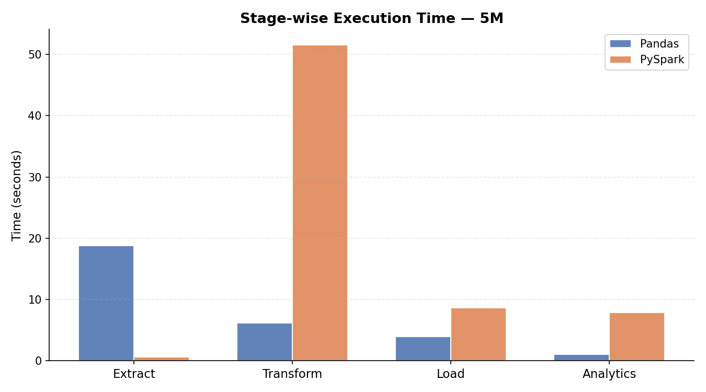

# Benchmark Report — Pandas vs PySpark ETL Pipeline

**Authors:** Aayush Ranjan & Shubham Thakur  
**Institute:** Chitkara Institute of Engineering and Technology

## Execution Summary

| Framework   | Scale   |   Raw Rows |   Clean Rows |   Cores |   Extract (s) |   Transform (s) |   Load (s) |   Analytics (s) |   Total (s) |   Peak Mem (MB) | Null Before   | Null After   | Rows Dropped %   |
|-------------|---------|------------|--------------|---------|---------------|-----------------|------------|-----------------|-------------|-----------------|---------------|--------------|------------------|
| Pandas      | 10K     |     10,000 |       10,000 |       1 |         0.059 |           0.086 |      0.482 |           0.053 |       0.681 |           207.9 | 0.16%         | 0.00%        | 0.00%            |
| Pandas      | 1M      |  1,000,000 |    1,000,000 |       1 |         2.976 |           1.194 |      0.723 |           0.237 |       5.133 |           312.3 | 0.14%         | 0.00%        | 0.00%            |
| Pandas      | 5M      |  5,000,000 |    5,000,000 |       1 |        18.767 |           6.149 |      3.938 |           1.076 |      29.957 |           743.8 | 0.14%         | 0.00%        | 0.00%            |
| Pyspark     | 10K     |     10,000 |       10,000 |      12 |         3.103 |           6.232 |      2.159 |           5.972 |      17.701 |           151.1 | 0.00%         | 0.00%        | 0.00%            |
| Pyspark     | 1M      |  1,000,000 |    1,000,000 |      12 |         0.32  |          20.553 |      3.299 |           6.795 |      31.193 |           151.1 | 0.00%         | 0.00%        | 0.00%            |
| Pyspark     | 5M      |  5,000,000 |    5,000,000 |      12 |         0.617 |          51.521 |      8.665 |           7.894 |      69.63  |           118.5 | 0.00%         | 0.00%        | 0.00%            |

## Speed-up Analysis

| Scale   | Pandas Total   | PySpark Total   | Speed-up   |
|---------|----------------|-----------------|------------|
| 10K     | 0.681s         | 17.701s         | 0.04×      |
| 1M      | 5.133s         | 31.193s         | 0.16×      |
| 5M      | 29.957s        | 69.630s         | 0.43×      |

## Charts

